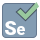

## My Skill Set  

  <code></code>
  <code></code>
  <code></code>
  <code></code>
  <code></code>
  <code></code>
  <code></code>
  <code></code>
  <code></code>
  <code></code>
  <code></code>

## Connect with me  

  

  
  

   

## Github Stats  

  

   

## Recent Blog Posts  
<!-- BLOG-POST-LIST:START -->  
If things goes well, this section should automatically be replaced by a list of your blog posts after you commit your readme file. 
<!-- BLOG-POST-LIST:END -->  

   

  

   

  
  

   

            
  

   

 

